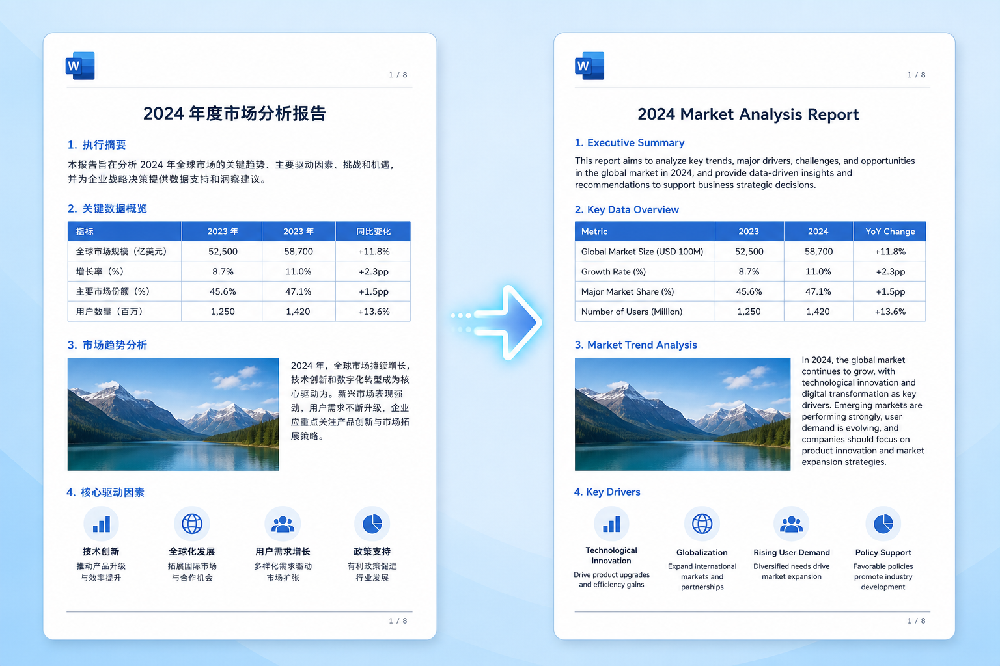
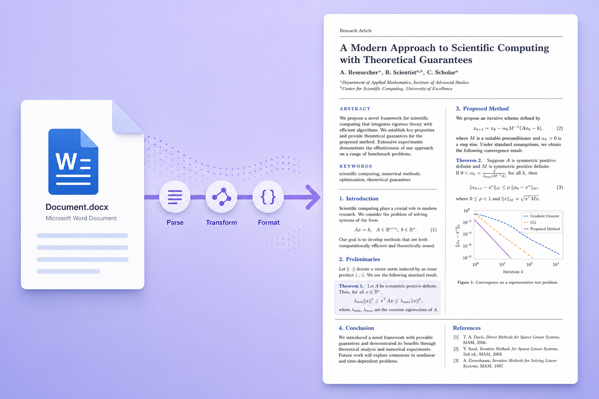

# EasyPaper

**学术论文格式化一站式工具** — 保留格式翻译 + Word 一键转 LaTeX

## [立即访问 https://easypaper.top/](https://easypaper.top/)


## 功能

### 学术翻译 — 格式完美保留

上传 Word 文档，AI 翻译后原样保留所有格式：表格、图片、公式、标题层级、字体样式全部不变。



### Word 转 LaTeX — 一键生成期刊模板

上传 .docx 文件，自动生成符合 Elsevier CAS 模板的 LaTeX 源码，包括章节结构、数学公式、图表引用、参考文献 BibTeX。



---

## 真实案例

### 案例一：学术论文中译英

**输入（中文 Word 文档）：**

> **学术论文示例文档**
>
> **摘要**：本文研究了深度学习在计算机视觉领域的应用。我们提出了一种新的卷积神经网络架构，在 ImageNet 数据集上取得了优异的性能。
>
> **1. 引言**：深度学习（Deep Learning）是机器学习的一个分支，近年来在图像识别、自然语言处理等领域取得了突破性进展。
>
> **2. 方法**：我们的模型使用以下损失函数：L = ∑(yi - ŷi)² + λ∑wi²

**输出（英文 Word 文档，格式完全保留）：**

> **Academic Paper Sample Document**
>
> **Abstract**: This paper investigates the application of deep learning in the field of computer vision. We propose a novel convolutional neural network architecture that achieves excellent performance on the ImageNet dataset.
>
> **1. Introduction**: Deep Learning is a branch of machine learning that has made breakthroughs in fields such as image recognition and natural language processing.
>
> **2. Method**: L = ∑(yi - ŷi)² + λ∑wi²

---

### 案例二：Word 转 Elsevier LaTeX

**输入（Word 论文）：**

> **Lightweight Underwater Sonar Object Detection Driven by Multi-Dimensional Representation Reconstruction (LUOD-MDR)**
>
> Abstract: Underwater object detection is an important prerequisite for underwater intelligent perception and multi-robot collaborative operations...
>
> Keywords: sonar target detection; Multi-dimensional representation reconstruction; Lightweight; Sonar echo

**输出（Elsevier CAS LaTeX 源码）：**

```latex
\documentclass[a4paper,fleqn]{cas-dc}
\usepackage{graphicx}
\usepackage{amsmath}

\begin{document}
\title{Lightweight Underwater Sonar Object Detection Driven by
  Multi-Dimensional Representation Reconstruction}

\begin{abstract}
Underwater object detection is an important prerequisite for
underwater intelligent perception and multi-robot collaborative
operations...
\end{abstract}

\begin{keywords}
sonar target detection \sep lightweight \sep sonar echo
\end{keywords}

\section{Introduction}
Underwater object detection is the fundamental link of underwater
intelligent perception and autonomous operation systems...

\bibliography{refs}
\end{document}
```

---

## 免费试用

我们提供 10 个限量邀请码，每个赠送 100 积分（约可翻译 2 篇论文或转换 5 次 LaTeX）：

| 邀请码 | 状态 |
|--------|------|
| `EP-TRIAL-A1X7` | 可用 |
| `EP-TRIAL-B2K9` | 可用 |
| `EP-TRIAL-C3M4` | 可用 |
| `EP-TRIAL-D5N8` | 可用 |
| `EP-TRIAL-E6P2` | 可用 |
| `EP-TRIAL-F7Q5` | 可用 |
| `EP-TRIAL-G8R1` | 可用 |
| `EP-TRIAL-H9S3` | 可用 |
| `EP-TRIAL-J4T6` | 可用 |
| `EP-TRIAL-K1W0` | 可用 |

## 使用方法

1. 访问 [https://easypaper.top/](https://easypaper.top/) 并注册（注册时填入邀请码）
2. 上传 Word 文档（.docx）
3. 选择「学术翻译」或「LaTeX 转换」
4. 等待几秒，下载结果

## 适用人群

- 需要投稿英文期刊的研究生
- 需要将中文论文翻译为英文的科研工作者
- 不熟悉 LaTeX 但期刊要求 LaTeX 投稿的作者
- 需要快速将 Word 论文转为 LaTeX 格式的学者

## 访问地址

**[https://easypaper.top/](https://easypaper.top/)**

## 反馈

如果你在使用过程中遇到问题或有建议，欢迎提 Issue。
